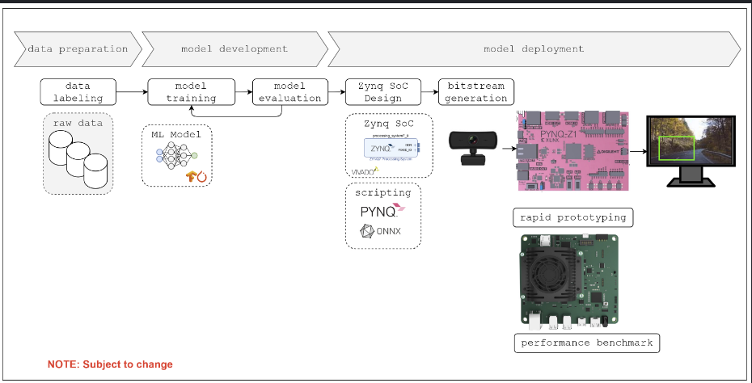

# GVSU MSE Project

This repository stores my GVSU MSE ECE Project.

**Note:** This project is a collaboration with Gentex Corporation, certain information withheld to honor non-disclosure agreements.

## Design Phases

The following section describes the design phases as outlined by Figure 1.

### Data Preparation

- finding a suitable data set
- manual/auto labeling data set
- creating training/testing data set

### Model Development

- develop a CNN model (TensorFlow/PyTorch)
- train CNN model (HPC)
- assess CNN performance (HPC)
- export CNN model at satisfactory performance (FINN-ONNX)

**Note:** Neural Network Development may be public, clarification required.

### Model Deployment

- Create Zynq SoC System + Model Integration (Vivado/Vitis)
- Generate Bitstream
- Load .bit file via PYNQ software stack
- Monitor and assess inference performance

**Note:** Neural Network Inference on FPGA may be private per Gentex NDA.

